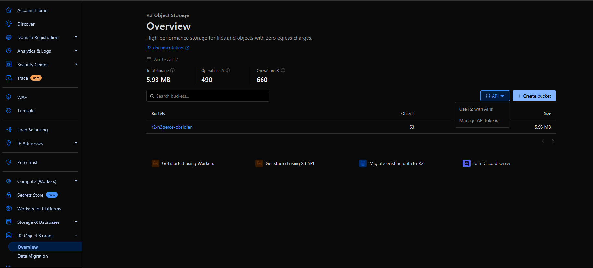

# R2 Guide

## Managing API Tokens for S3 via the Dashboard


⚠️ **The Secret Access Key is only shown once at the time of token creation.** Be sure to copy and store it securely.

You can store the credentials in a file like the following:

```toml:r2-user-token.toml
token_name = "R2 User Token"
token_value = "****************vG"
access_key_id = "****************e9"
secret_access_key = "****************b3"

[endpoints]
default = "https://****************bb.r2.cloudflarestorage.com"
eu = "https://****************bb.eu.r2.cloudflarestorage.com"
```

If you forget the Secret Access Key, you must delete the token and create a new one — it cannot be retrieved later.
