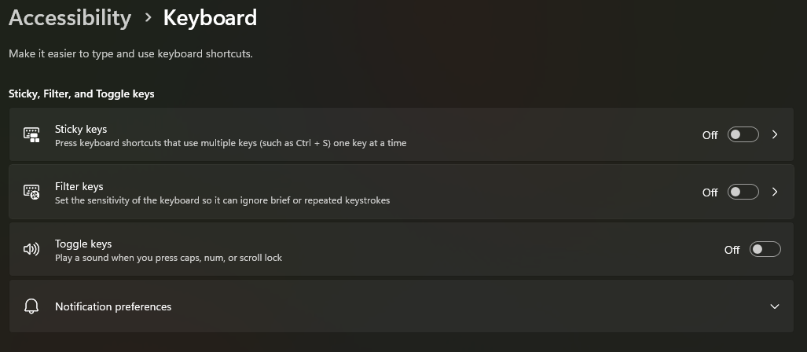
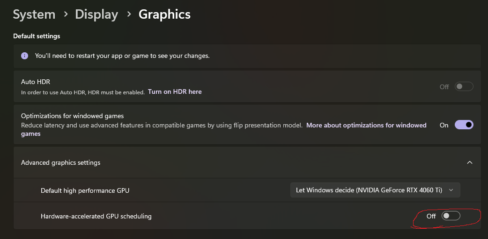
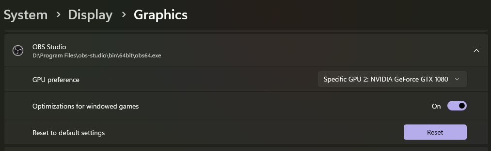

# Windows Configulations

## Backup Current Registry

Create a backup of your current registry before modifying it in the next step.

```ps1
$backupFolderPath = Join-Path -Path $env:USERPROFILE -ChildPath "Documents\RegBackup"
if (-not (Test-Path -Path $backupFolderPath)) {
    New-Item -Path $backupFolderPath -ItemType Directory
}

$backupFilePath = Join-Path -Path $backupFolderPath -ChildPath "${env:USERNAME}-HKCU-$(Get-Date -Format 'yyyyMMddHHmmss').reg"
reg export "HKCU" $backupFilePath
```

## Turn off Sticky, Filter, Toggle keys

`ms-settings:easeofaccess-keyboard`

- Sticky keys: Off
- Filter keys: Off
- Toggle keys: Off



## Right Click Menu: Show More as Default (Classic Context Menu)

```ps1
reg.exe add "HKCU\Software\Classes\CLSID\{86ca1aa0-34aa-4e8b-a509-50c905bae2a2}\InprocServer32" /f /ve
```

## Time Format

`ms-settings:regionformatting` > Language & region > Regional format > Change fomats

## Graphics

`ms-settings:display-advancedgraphics`

### Turn Off Hardware-accelerated GPU



### Specify GPU Preference Per App


