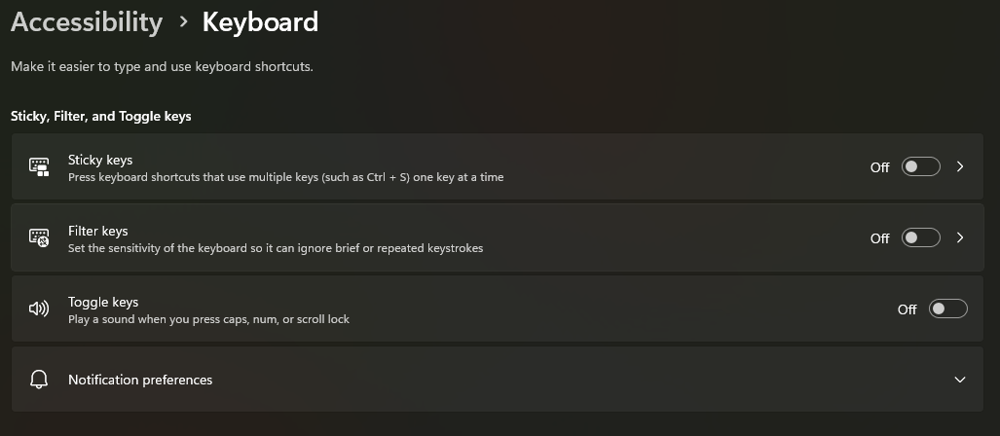
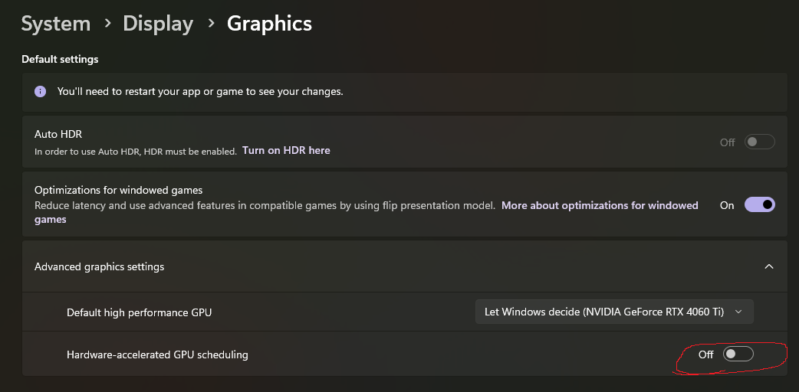
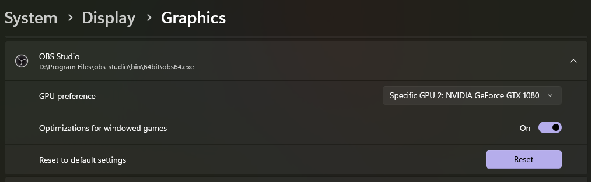

# Windows Configulations

## Backup Current Registry

Create a backup of your current registry before modifying it in the next step.

```ps1
Start-Process powershell -ArgumentList "-NoProfile -ExecutionPolicy Bypass -File `"$(Resolve-Path .\scripts\Backup-Registry-HKCU.ps1)`"" -Verb RunAs
```

## Turn Off Accessibility Shortcuts

### Sticky, Filter, Toggle keys

`ms-settings:easeofaccess-keyboard` >

- Sticky keys: Off
- Filter keys: Off
- Toggle keys: Off



### Turn off Narrator

`ms-settings:easeofaccess-narrator` > Keyboard shortcut for Narrator: Off

## Right Click Menu: Show More as Default (Classic Context Menu)

```ps1
reg.exe add "HKCU\Software\Classes\CLSID\{86ca1aa0-34aa-4e8b-a509-50c905bae2a2}\InprocServer32" /f /ve
```

## Time Format

`ms-settings:regionformatting` > Language & region > Regional format > Change fomats

## Graphics

`ms-settings:display-advancedgraphics`

### Turn Off Hardware-accelerated GPU



### Specify GPU Preference Per App


